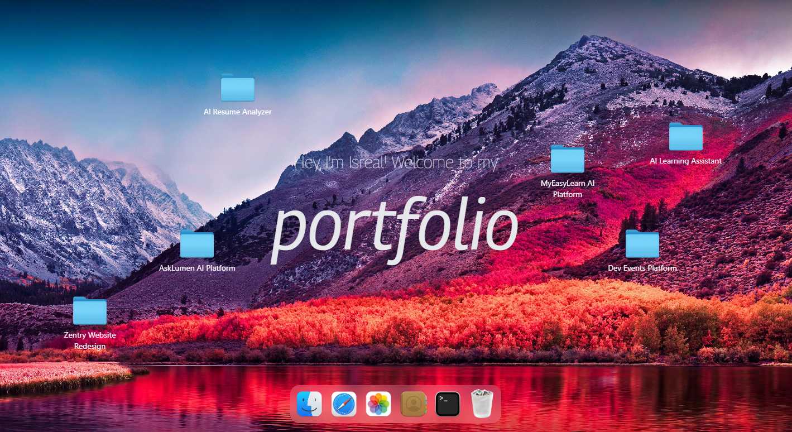

<div align="center">
  

  <h1>💻 Isreal's macOS Portfolio</h1>
  
  <p>A sleek, interactive, and fully functional web portfolio inspired by macOS. Built with React, Vite, Tailwind CSS, and GSAP!</p>

  <div>
    
    
    
    
  </div>
</div>

---

## ✨ Features

- **🍏 Authentic macOS Experience**: Interact with windows, folders, and a functional dock!
- **⚡ Blazing Fast**: Highly optimized with React Lazy Loading, Suspense, and compressed WebP assets.
- **🎨 Beautiful Animations**: Smooth typography changes, dragging, and scaling powered by GSAP.
- **🌗 Dark Mode Supported**: Seamlessly toggle between dark and light themes just like a real Mac!

## 🚀 Getting Started

If you'd like to run this portfolio locally or customize it for yourself, follow these steps:

### 1. Clone the repository
```bash
git clone https://github.com/Jeezlouis/MacOS-Portfolio.git
cd MacOS-Portfolio
```

### 2. Install dependencies
```bash
npm install
```

### 3. Start the development server
```bash
npm run dev
```

### 4. Build for Production
To create an optimized production build:
```bash
npm run build
npm run preview
```

## 🛠️ Built With

* **Frontend**: React (v19)
* **Build Tool**: Vite
* **Styling**: Tailwind CSS (v4)
* **Animations**: GSAP & @gsap/react
* **State Management**: Zustand (+ Immer)
* **Icons**: Lucide React

## 💡 Acknowledgements
Crafted with ❤️ and an eye for design. 

Looking for a software engineer who loves smooth animations and great UX? **[Let's connect!](https://mac-os-portfolio-jade.vercel.app/)**
